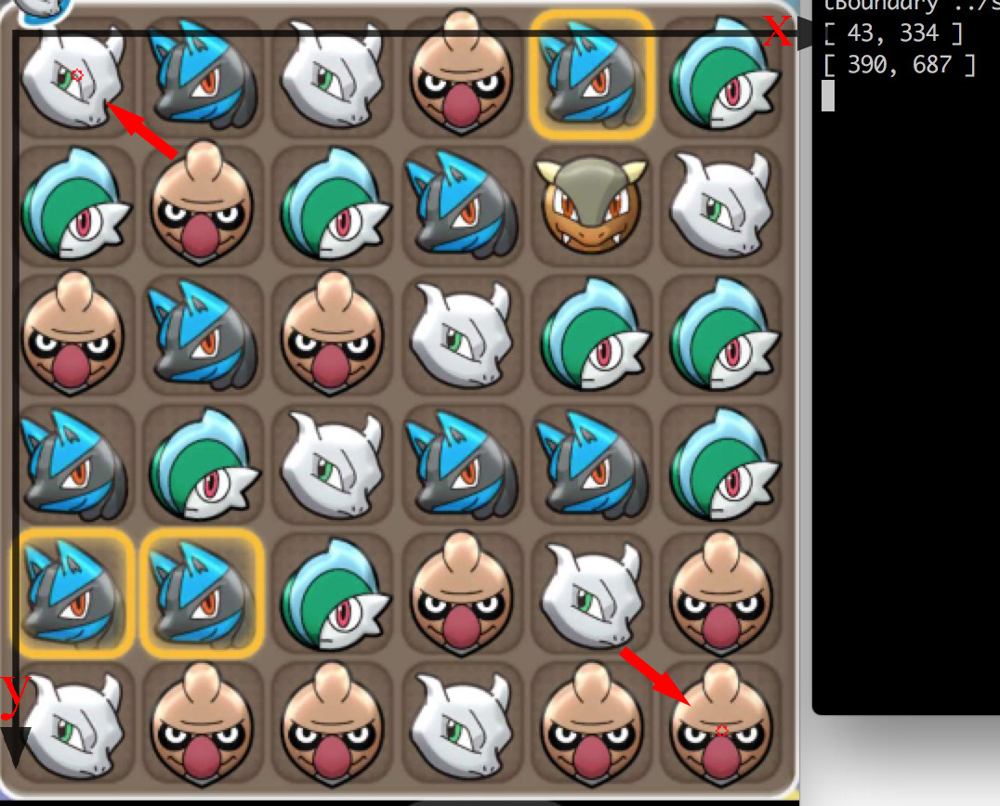
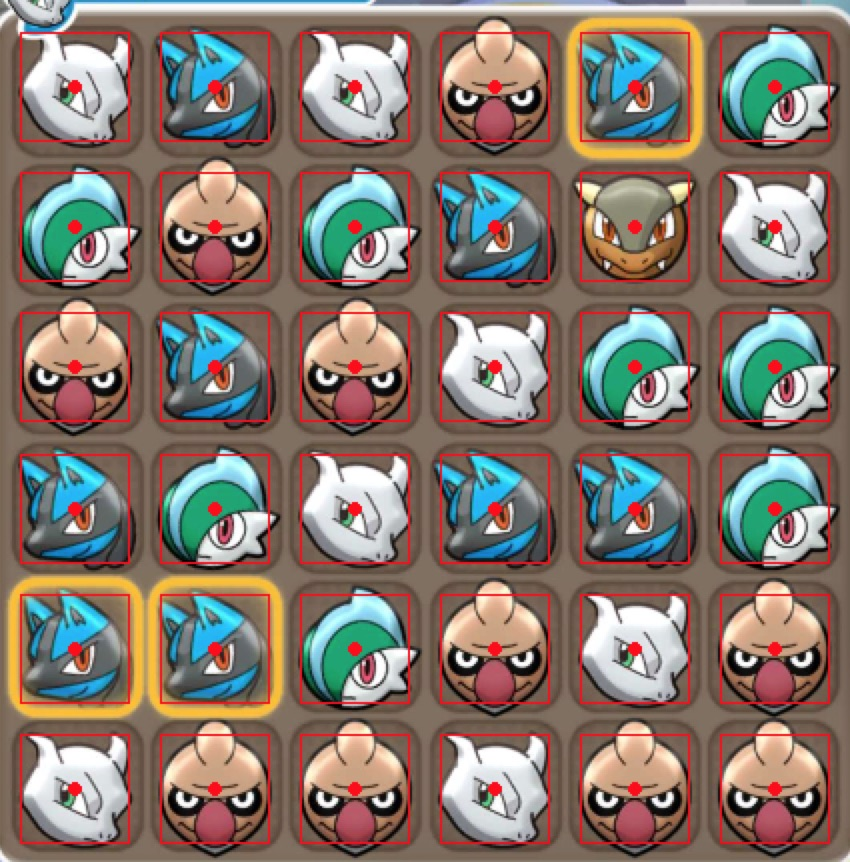

# Shuffle Move Helper

A program to identify the screenshot and generate corresponding configuration file used by [Shuffle-Move](https://github.com/Loreinator/Shuffle-Move).

## Installation

You should have c++ compiler(xcode, gcc or VS) and CMAKE installed on your computer.

1. Install OpenCV

   - Windows：download [win pack](https://opencv.org/releases.html) and install
   - Mac: `brew install opencv`
   - Ubuntu: `sudo apt-get install libopencv-dev`

2. Build the ShuffleMoveHelper

   - Mac&Ubuntu: 

     ```shell
     mkdir build
     cd build
     cmake ..
     make -j4
     ```

   - Windows(more complicate...):

     Use CMAKE to build, remember to set the `OpenCV_DIR` in `CMakeLists.txt`

## Instructions

After building the program, you will see `adjustBoundary` and `ShuffleMoveHelper`.

1. First, we should manually set the position and the size of the game board by `adjustBoundary`. But you could skip this step if the size of your screenshot is exactly the same as mine listed in the folder `sample`.

   - Launch the program in terminal `./adjustBoundary ../sample/screen.jpeg` and click the center of the first and the last pokemon. Their coordinate will be shown meanwhile. Press any key to exit and the parameters will be saved in `config.txt`.

     

   - Verify the result by command `./adjustBoundary ../sample/screen.jpeg 1`. The only difference is we add a second parameter. Then we can see the red bounding boxes are evenly distributed. You also can manually edit the `config.txt` and then rerun this program to improve the accuracy of our identification.

     

   - The parameters in `config.txt` is topLeft.x, topLeft.y, bottomRight.x, bottomRight.y, half size of the bounding box

2. Now, it's time to identify the sceenshot!

   - Upload the sceenshot to PC
   - Open `Shuffle-Move`, select Stage and your Team, edit Roster. Then place your team to the first row and save all (File->save). Remember you should put mega pokemon first!

   

   - Open the configuration file (Mac&ubuntu: `~/Shuffle-Move/config/boards/board.txt`, Win: I don't know…) . Copy the `Stage` and `pokemons` you selected and edit `team.txt`. I have already written some cases (the `Shuffle Move Helper` only read the first two row of `team.txt`, so you can write anything bellow).

   - Run the program, `./ShuffleMoveHelper ../sample/screen.jpeg 8`, the last paramter indicates the mega process. Or you can just use `./ShuffleMoveHelper ../sample/screen.jpeg` if you doesn't care about it. After all, we can see the output

     ```
     Load Stage and Team...
      * Stage: NORMAL
      * Mega Process 8/12
      - Mewtwo_xs img/icons/150-s.png
      - Lucario img/icons/448.png
      - Conkeldurr img/icons/534.png
      - Gallade img/icons/475.png
     Game board:
     1 2 1 3 2 4
     4 3 4 2 5 1
     3 2 3 1 4 4
     2 4 1 2 2 4
     2 2 4 3 1 3
     1 3 3 1 3 3
     ```

     And the `board.txt`

     ```
     STAGE NORMAL
     MEGA_PROGRESS 8
     STATUS NONE
     STATUS_DURATION 0
     ROW_1 Mewtwo_xs,Lucario,Mewtwo_xs,Conkeldurr,Lucario,Gallade
     FROW_1 false,false,false,false,false,false
     CROW_1 false,false,false,false,false,false
     ROW_2 Gallade,Conkeldurr,Gallade,Lucario,Air,Mewtwo_xs
     FROW_2 false,false,false,false,false,false
     CROW_2 false,false,false,false,false,false
     ROW_3 Conkeldurr,Lucario,Conkeldurr,Mewtwo_xs,Gallade,Gallade
     FROW_3 false,false,false,false,false,false
     CROW_3 false,false,false,false,false,false
     ROW_4 Lucario,Gallade,Mewtwo_xs,Lucario,Lucario,Gallade
     FROW_4 false,false,false,false,false,false
     CROW_4 false,false,false,false,false,false
     ROW_5 Lucario,Lucario,Gallade,Conkeldurr,Mewtwo_xs,Conkeldurr
     FROW_5 false,false,false,false,false,false
     CROW_5 false,false,false,false,false,false
     ROW_6 Mewtwo_xs,Conkeldurr,Conkeldurr,Mewtwo_xs,Conkeldurr,Conkeldurr
     FROW_6 false,false,false,false,false,false
     CROW_6 false,false,false,false,false,false

     ```

     ​

   - Copy `board.txt` to `~/Shuffle-Move/config/boards/board.txt`, Skip this step if on Mac or Ubuntu.

   - Load the board (File->Load)

   


## Planned Features

1. Rewrite the program with python (python is more convenient than gcc)
2. Identify the coin
3. More automatic